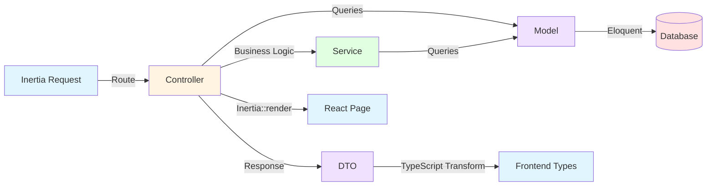
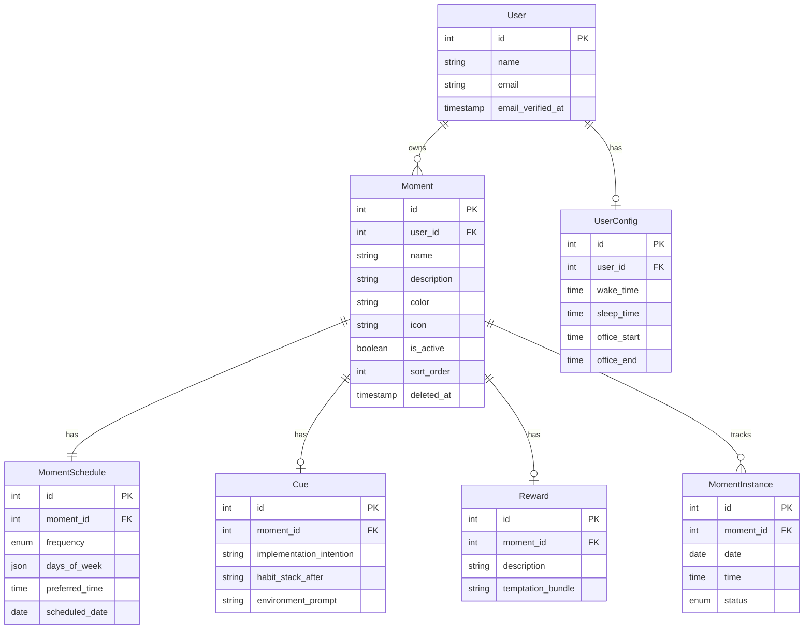
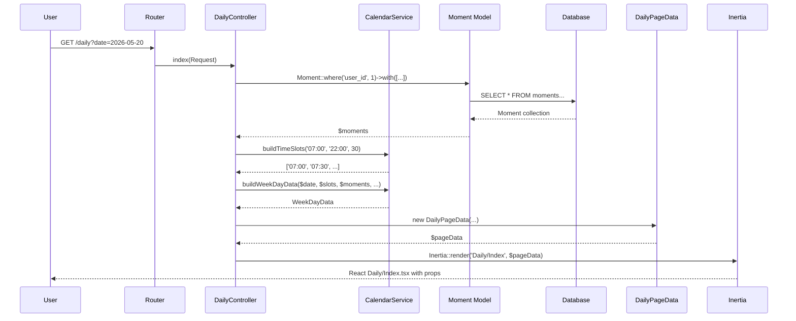
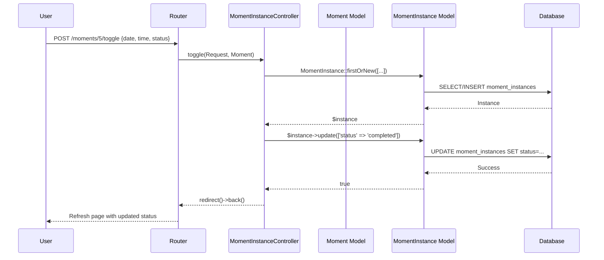
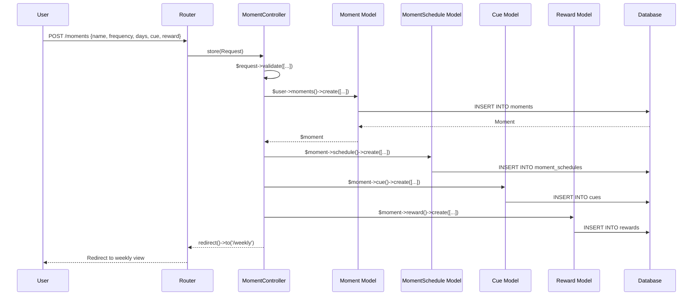
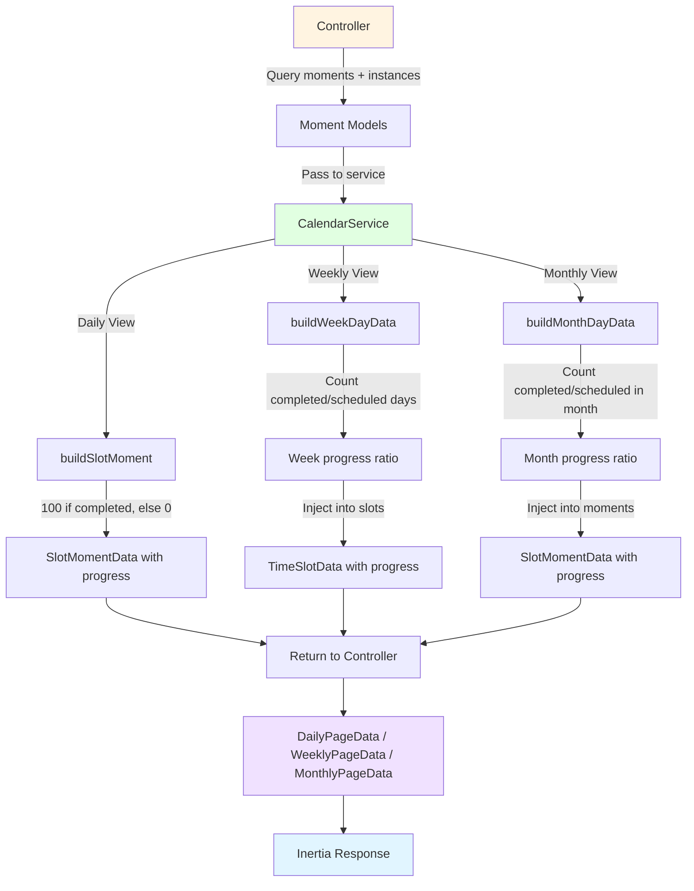

# Backend Architecture

## Overview

This document outlines the Laravel backend architecture for the Momentum application, following **clean MVC patterns** with service layer abstraction, Data Transfer Objects (DTOs), and Eloquent ORM.

## Core Principles

1. **Controller → Service → Model** - Controllers orchestrate, Services contain business logic, Models handle data
2. **Data Transfer Objects (DTOs)** - Type-safe data structures for frontend communication (Spatie Laravel Data)
3. **Single Responsibility** - Each controller manages one resource domain
4. **Service Layer** - Complex business logic extracted to reusable services
5. **Eloquent Relationships** - Models define relationships, eager loading prevents N+1

---

## Request Flow Architecture



**Legend:**
- 🔵 Blue = Client (Inertia requests/React pages)
- 🟡 Yellow = Controllers (request handlers)
- 🟣 Purple = Models & DTOs (data layer)
- 🟢 Green = Services (business logic)
- 🔴 Red = Database (persistence)

---

## Directory Structure

```
app/
├── Console/
│   └── Commands/                   # Artisan commands
│
├── Data/                           # DTOs (Spatie Laravel Data)
│   ├── CueData.php
│   ├── DailyPageData.php
│   ├── MomentData.php
│   ├── MomentScheduleData.php
│   ├── MonthlyDayData.php
│   ├── MonthlyPageData.php
│   ├── MonthlyScheduleRowData.php
│   ├── RewardData.php
│   ├── SlotMomentData.php         # Unified calendar moment DTO
│   ├── TimeSlotData.php
│   ├── UserConfigData.php
│   ├── WeekDayData.php
│   └── WeeklyPageData.php
│
├── Enums/
│   └── Frequency.php               # daily, weekly, custom, once
│
├── Http/
│   ├── Controllers/
│   │   ├── Auth/                   # Laravel Breeze auth controllers
│   │   ├── ConfigController.php   # User config management
│   │   ├── ContentController.php  # Static content pages
│   │   ├── DailyController.php    # Daily calendar view
│   │   ├── MomentController.php   # Moment CRUD
│   │   ├── MomentInstanceController.php  # Toggle moment completion
│   │   ├── MonthlyController.php  # Monthly calendar view
│   │   ├── ProfileController.php  # User profile (Breeze)
│   │   └── WeeklyController.php   # Weekly calendar view
│   ├── Middleware/
│   └── Requests/
│       ├── Auth/
│       └── ProfileUpdateRequest.php
│
├── Models/
│   ├── Cue.php                     # Implementation intention, habit stacking
│   ├── Moment.php                  # Core habit/routine model
│   ├── MomentInstance.php          # Daily completion tracking
│   ├── MomentSchedule.php          # Frequency, days, preferred time
│   ├── Reward.php                  # Reward descriptions, temptation bundling
│   ├── User.php
│   └── UserConfig.php              # Wake/sleep times, office hours
│
├── Providers/
│   ├── AppServiceProvider.php
│   └── TypeScriptTransformerServiceProvider.php  # DTO → TS type generation
│
└── Services/
    ├── CalendarService.php         # Calendar aggregation & progress computation
    ├── MomentExportService.php     # Export moments to JSON
    └── MomentImportService.php     # Import moments from JSON
```

---

## Core Components

### 1. Controllers (Request Orchestrators)

Controllers handle HTTP requests, validate input, orchestrate service calls, and return Inertia responses.

| Controller | Responsibility | Key Methods |
|------------|----------------|-------------|
| `DailyController` | Daily calendar view | `index()` - Render daily time slots |
| `WeeklyController` | Weekly calendar view | `index()` - Render 7-day grid |
| `MonthlyController` | Monthly calendar view | `index()` - Render month calendar |
| `MomentController` | Moment CRUD | `create()`, `store()`, `edit()`, `update()`, `destroy()` |
| `MomentInstanceController` | Completion tracking | `toggle()` - Mark moment complete/incomplete |
| `ConfigController` | User settings | `edit()`, `update()`, `exportMoments()` |
| `ProfileController` | User profile (Breeze) | `edit()`, `update()`, `destroy()` |
| `ContentController` | Static content | `show()` - Serve markdown pages |

**Pattern:**
```php
class DailyController extends Controller
{
    public function __construct(private CalendarService $calendar) {}

    public function index(Request $request): Response
    {
        // 1. Get authenticated user
        $user = $request->user();
        
        // 2. Parse/validate request parameters
        $date = $request->filled('date') 
            ? Carbon::parse($request->input('date'))
            : Carbon::today();
        
        // 3. Query models with eager loading
        $moments = Moment::query()
            ->where('user_id', $user->id)
            ->with(['schedule', 'cue', 'instances'])
            ->get();
        
        // 4. Use service for business logic
        $day = $this->calendar->buildWeekDayData($date, $slots, $moments, ...);
        
        // 5. Transform to DTOs
        $pageData = new DailyPageData(...);
        
        // 6. Return Inertia response
        return Inertia::render('Daily/Index', $pageData->toArray());
    }
}
```

---

### 2. Models (Eloquent ORM)

Models represent database tables, define relationships, and contain query scopes.



**Relationships:**
- **User** `hasMany` Moments, `hasOne` UserConfig
- **Moment** `hasOne` MomentSchedule, `hasOne` Cue, `hasOne` Reward, `hasMany` MomentInstances
- **MomentInstance** `belongsTo` Moment

**Key Methods:**
- `Moment::isScheduledFor(Carbon $date): bool` - Check if moment is scheduled for date
- `Moment::isCompletedOn(Carbon $date): bool` - Check if moment completed on date

**Enum Casting:**
```php
// MomentSchedule.php
protected $casts = [
    'frequency' => \App\Enums\Frequency::class,  // Auto-cast to enum
    'days_of_week' => 'array',
];
```

---

### 3. Services (Business Logic Layer)

Services encapsulate complex business logic that would clutter controllers.

#### CalendarService

**Responsibility:** Calendar data aggregation, time slot generation, progress computation

**Key Methods:**

```php
class CalendarService
{
    /**
     * Build array of time slots (e.g., ['07:00', '07:30', '08:00', ...])
     */
    public function buildTimeSlots(string $wakeTime, string $sleepTime, int $intervalMinutes = 30): array

    /**
     * Snap a time to nearest slot boundary (e.g., '08:23' → '08:30')
     */
    public function snapToSlot(string $time, int $intervalMinutes = 30): string

    /**
     * Calculate 28-day consistency percentage (0-100)
     */
    public function calculateConsistency(Moment $moment, Carbon $windowStart, Carbon $today): ?int

    /**
     * Build SlotMomentData with progress for a moment
     * Daily: 100 if completed, else 0
     */
    public function buildSlotMoment(Moment $moment, Carbon $date, ?string $status, ?int $instanceId, ?int $consistency): SlotMomentData

    /**
     * Build WeekDayData with time slots and assigned moments
     * Computes per-slot progress
     */
    public function buildWeekDayData(Carbon $date, array $slots, Collection $dayMoments, bool $isPast, bool $isToday, Carbon $consistencyWindow, Carbon $today, int $intervalMinutes = 30): WeekDayData

    /**
     * Build MonthlyDayData for calendar grid
     * Computes per-moment monthly progress
     */
    public function buildMonthDayData(Carbon $date, Collection $dayMoments, Carbon $consistencyWindow, Carbon $today, Carbon $monthStart, Carbon $monthEnd): MonthlyDayData
}
```

**Progress Computation Logic:**
- **Daily:** `buildSlotMoment()` returns 100 if completed today, else 0
- **Weekly:** `buildWeekDayData()` computes week-aggregate progress per moment
- **Monthly:** `buildMonthDayData()` computes month-aggregate progress per moment

---

### 4. Data Transfer Objects (DTOs)

DTOs provide type-safe data structures for frontend communication using **Spatie Laravel Data**.

**Key DTOs:**

| DTO | Purpose | Generated TypeScript Type |
|-----|---------|---------------------------|
| `SlotMomentData` | Moment in calendar slot with progress | `App.Data.SlotMomentData` |
| `TimeSlotData` | Time slot with assigned moment | `App.Data.TimeSlotData` |
| `WeekDayData` | Day data with time slots | `App.Data.WeekDayData` |
| `MonthlyDayData` | Month day with moments | `App.Data.MonthlyDayData` |
| `DailyPageData` | Full daily page props | `App.Data.DailyPageData` |
| `WeeklyPageData` | Full weekly page props | `App.Data.WeeklyPageData` |
| `MonthlyPageData` | Full monthly page props | `App.Data.MonthlyPageData` |
| `MomentData` | Full moment with relations | `App.Data.MomentData` |
| `UserConfigData` | User wake/sleep config | `App.Data.UserConfigData` |

**Example: SlotMomentData**
```php
#[TypeScript]
class SlotMomentData extends Data
{
    public function __construct(
        public int $id,
        public string $name,
        public ?string $description,
        public ?string $icon,
        public ?string $color,
        public ?Frequency $frequency,
        public ?int $consistency,        // 28-day consistency (0-100)
        public ?string $status,          // 'completed', 'pending', null
        public ?int $instance_id,
        public ?string $implementation_intention,
        public ?string $habit_stack_after,
        public ?string $environment_prompt,
        public ?int $progress = null,    // View-specific progress (0-100)
    ) {}
}
```

**TypeScript Generation:**
```bash
php artisan typescript:transform
```
Generates: `resources/js/types/generated.d.ts`

---

### 5. Routes

**Route Pattern:** RESTful + custom actions

```php
// ─── Calendar Views ───────────────────────────────────────────────────────
Route::get('/daily', [DailyController::class, 'index'])->name('daily');
Route::get('/weekly', [WeeklyController::class, 'index'])->name('weekly');
Route::get('/monthly', [MonthlyController::class, 'index'])->name('monthly');

// ─── Moment CRUD ──────────────────────────────────────────────────────────
Route::resource('moments', MomentController::class)
    ->only(['create', 'store', 'edit', 'update', 'destroy']);

// ─── Moment Completion ────────────────────────────────────────────────────
Route::post('/moments/{moment}/toggle', [MomentInstanceController::class, 'toggle'])
    ->name('moments.toggle');

// ─── Config ───────────────────────────────────────────────────────────────
Route::get('/config', [ConfigController::class, 'edit'])->name('config.edit');
Route::put('/config', [ConfigController::class, 'update'])->name('config.update');
Route::get('/config/moments/export', [ConfigController::class, 'exportMoments'])
    ->name('config.moments.export');
```

---

## Data Flow Examples

### Example 1: Daily View Request



### Example 2: Complete Moment



### Example 3: Create Moment



---

## Key Patterns & Best Practices

### 1. Service Injection via Constructor

```php
class DailyController extends Controller
{
    public function __construct(private CalendarService $calendar) {}
    
    public function index(Request $request): Response
    {
        // Use $this->calendar->buildTimeSlots(...)
    }
}
```

**Why:** Automatic dependency injection, testable, follows Laravel conventions

---

### 2. Eager Loading to Prevent N+1

```php
// ❌ Bad: N+1 queries
$moments = Moment::where('user_id', $user->id)->get();
foreach ($moments as $moment) {
    echo $moment->schedule->frequency;  // Lazy loads for each moment
}

// ✅ Good: Eager loading
$moments = Moment::query()
    ->where('user_id', $user->id)
    ->with(['schedule', 'cue', 'reward', 'instances'])
    ->get();
```

---

### 3. DTO Transformation

```php
// ✅ Controller returns DTOs
return Inertia::render('Daily/Index', [
    'date' => $date->toDateString(),
    'day' => $day,  // WeekDayData automatically serialized
    'config' => new UserConfigData(...),
]);

// ❌ Don't return raw models
return Inertia::render('Daily/Index', [
    'moment' => $moment,  // Exposes all model internals
]);
```

---

### 4. Enum Casting

```php
// Model
protected $casts = [
    'frequency' => \App\Enums\Frequency::class,
];

// Controller - no manual conversion needed
$frequency = $moment->schedule->frequency;  // Already Frequency enum instance
```

---

### 5. Service Layer Abstraction

**When to use services:**
- Complex business logic (calendar aggregation, progress computation)
- Reusable across multiple controllers
- Heavy computation or external API calls
- Domain logic that doesn't belong in models

**When NOT to use services:**
- Simple CRUD operations
- Basic query scopes (use model methods instead)
- One-off logic used in single controller

---

## Database Schema Summary

```
users
├── user_configs (wake_time, sleep_time, office hours)
└── moments (name, description, color, icon)
    ├── moment_schedules (frequency, days_of_week, preferred_time)
    ├── cues (implementation_intention, habit_stack, environment)
    ├── rewards (description, temptation_bundle)
    └── moment_instances (date, time, status)
```

**Key Indexes:**
- `moments.user_id` - Fast user moment lookups
- `moment_instances.moment_id, date` - Fast completion lookups
- `moment_schedules.moment_id` - Fast schedule joins

---

## Progress Computation Flow



**Key Insight:** Progress is **computed per-view** in `CalendarService`, not stored in database.

---

## API Response Structure

### Daily View
```php
DailyPageData {
    date: "2026-05-20",
    day: WeekDayData {
        date: "2026-05-20",
        day_name: "Wednesday",
        is_today: true,
        is_past: false,
        slots: [
            TimeSlotData {
                time: "07:00",
                moment: SlotMomentData {
                    id: 1,
                    name: "Morning Brush",
                    icon: "🪥",
                    progress: 100,  // Completed today
                    status: "completed",
                    ...
                }
            },
            TimeSlotData {
                time: "07:30",
                moment: SlotMomentData {
                    id: 2,
                    name: "Journal",
                    progress: 0,  // Not completed today
                    status: null,
                    ...
                }
            },
            ...
        ]
    },
    config: UserConfigData {...},
    completedCount: 5,
    totalCount: 12
}
```

### Weekly View
```php
WeeklyPageData {
    week_start: "2026-05-18",
    week_end: "2026-05-24",
    days: [
        WeekDayData {
            date: "2026-05-18",
            slots: [
                TimeSlotData {
                    moment: SlotMomentData {
                        progress: 71,  // 5/7 days completed this week
                        ...
                    }
                }
            ]
        },
        ...
    ],
    config: UserConfigData {...}
}
```

### Monthly View
```php
MonthlyPageData {
    month_start: "2026-05-01",
    month_end: "2026-05-31",
    days: [
        MonthlyDayData {
            date: "2026-05-01",
            moments: [
                SlotMomentData {
                    progress: 48,  // 15/31 days completed this month
                    ...
                }
            ]
        },
        ...
    ],
    scheduleRows: [
        MonthlyScheduleRowData {
            moment: MomentData {...},
            days: [...],  // 31 booleans for each day
        }
    ]
}
```

---

## Testing Considerations

### Model Tests
- Relationship integrity
- Scope methods
- `isScheduledFor()`, `isCompletedOn()` logic

### Service Tests
- `buildTimeSlots()` edge cases (midnight crossing)
- `calculateConsistency()` accuracy
- Progress computation (daily/weekly/monthly)

### Controller Tests
- Authorization (user can only see own moments)
- Query optimization (eager loading)
- DTO transformation correctness

---

## Performance Optimizations

### 1. Eager Loading
```php
// Load all relations in one query
->with(['schedule', 'cue', 'reward', 'instances'])
```

### 2. Date Range Filtering
```php
// Only load instances in 28-day consistency window
'instances' => fn($q) => $q->whereBetween('date', [$start, $end])
```

### 3. Index Optimization
- Index `moment_instances.moment_id` for fast lookups
- Index `moment_instances.date` for date range queries

### 4. Service Layer Caching
```php
// Cache time slots generation (expensive for large ranges)
Cache::remember("slots_{$wakeTime}_{$sleepTime}", 3600, fn() => 
    $this->buildTimeSlots($wakeTime, $sleepTime)
);
```

---

## Common Pitfalls

### ❌ Don't Return Raw Models to Frontend
```php
// Bad
return Inertia::render('Daily/Index', ['moment' => $moment]);
```
**Why:** Exposes all model internals (timestamps, deleted_at, etc.)

### ❌ Don't Compute Progress in Controller
```php
// Bad
$progress = $moment->instances()->count() / 28 * 100;
```
**Why:** Business logic belongs in service layer

### ❌ Don't Forget Enum Casting
```php
// Bad
protected $casts = ['frequency' => 'string'];  // Still a string
```
**Why:** Type safety lost, requires manual `Frequency::from()` calls

### ❌ Don't Mix View Logic in Service
```php
// Bad - CalendarService
public function renderDailyView($date) {
    return view('daily', [...]);  // Wrong layer
}
```
**Why:** Services handle data, controllers handle responses

---

## Migration Path (If Refactoring)

### Phase 1: Extract Service Logic
- Move complex controller logic to `CalendarService`
- Create `MomentService` for CRUD business logic

### Phase 2: Standardize DTOs
- Ensure all Inertia responses use DTOs
- Add `#[TypeScript]` attribute to all DTOs
- Run `php artisan typescript:transform`

### Phase 3: Optimize Queries
- Add missing eager loads
- Index frequently queried columns
- Add query scopes for common patterns

### Phase 4: Add Tests
- Service tests for business logic
- Controller tests for request handling
- Model tests for relationships

---

## Key Takeaways

1. **Controllers orchestrate, don't compute** - Keep controllers thin
2. **Services contain business logic** - Extract complex logic to services
3. **DTOs provide type safety** - Always transform to DTOs before Inertia response
4. **Eager load relationships** - Prevent N+1 queries with `->with()`
5. **Use enum casting** - Type-safe enums with automatic casting
6. **Progress is computed, not stored** - Calculate per-view in `CalendarService`

---

## References

- Laravel Documentation: https://laravel.com/docs
- Spatie Laravel Data: https://spatie.be/docs/laravel-data
- Inertia.js: https://inertiajs.com
- Eloquent Performance: https://laravel.com/docs/eloquent#eager-loading
