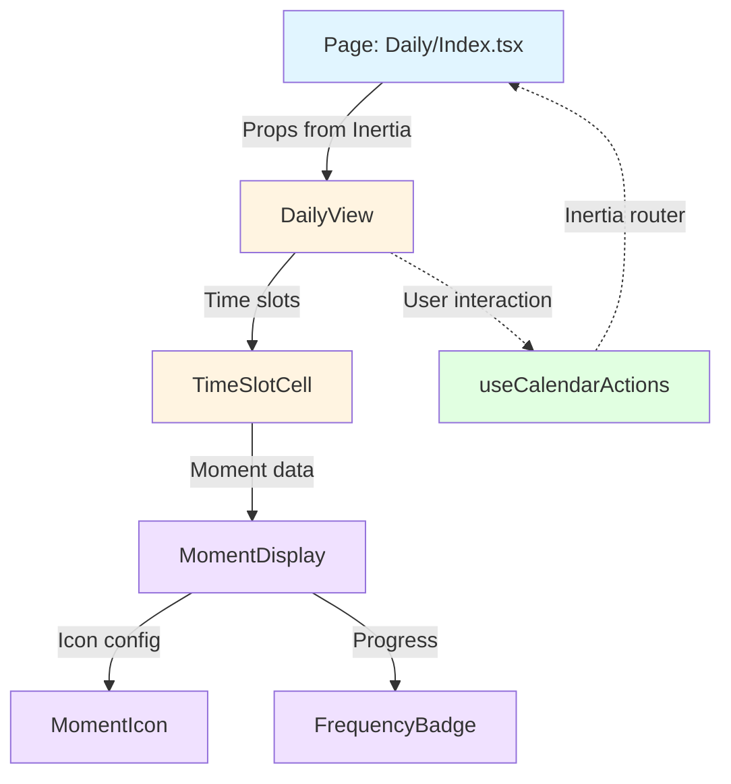

# Frontend Architecture

## Overview

This document outlines the React/TypeScript architecture for the Momentum application, following a **feature-based DRY approach** with clear separation of concerns.

## Core Principles

1. **Feature-based structure** - Business domains are self-contained modules
2. **Barrel exports** - Clean public API via `index.ts` files
3. **Shared components** - Generic UI lives in `shared/components/`
4. **Thin pages** - Pages orchestrate features, don't contain business logic
5. **Hook-based logic** - Business logic extracted to custom hooks

---

## Current Architecture

```
resources/js/
├── Pages/                          # Route-level containers (thin orchestrators)
│   ├── Daily/Index.tsx
│   ├── Weekly/Index.tsx
│   ├── Monthly/Index.tsx
│   ├── Moments/Create.tsx
│   └── Config/Edit.tsx
│
├── features/                       # Business domain modules
│   ├── moments/                    # ✅ IDEAL - Follow this pattern
│   │   ├── components/
│   │   │   ├── MomentForm.tsx      (7 focused components)
│   │   │   ├── MomentModal.tsx
│   │   │   ├── ColorPicker.tsx
│   │   │   ├── IconPicker.tsx
│   │   │   ├── ScheduleFields.tsx
│   │   │   ├── CueFields.tsx
│   │   │   └── RewardFields.tsx
│   │   ├── hooks/
│   │   │   └── useMomentForm.ts
│   │   ├── index.ts                (barrel export)
│   │   └── types.ts
│   │
│   ├── config/                     # ✅ IDEAL - Minimal & focused
│   │   ├── components/
│   │   │   ├── ConfigForm.tsx      (2 components)
│   │   │   └── SleepHelper.tsx
│   │   ├── index.ts
│   │   └── types.ts
│   │
│   ├── scheduling/                 # ✅ IDEAL - Hook-based logic
│   │   ├── index.ts
│   │   ├── types.ts
│   │   ├── transition.ts
│   │   └── useScheduling.ts
│   │
│   └── calendar/                   # ❌ NEEDS REFACTOR - Too many components, mixed concerns
│       ├── components/             (15 components - TOO MANY)
│       │   ├── WeeklyGrid.tsx          # View container (should be WeeklyView)
│       │   ├── MonthlyVerticalView.tsx # View container (should be MonthlyView)
│       │   ├── DailyTimeSlotCell.tsx   # Layout wrapper
│       │   ├── TimeSlotCell.tsx        # Layout wrapper
│       │   ├── MonthlyDayCell.tsx      # Layout wrapper
│       │   ├── MomentActionItem.tsx    # Display (should be in shared/)
│       │   ├── DailySlotCard.tsx       # Display (legacy?)
│       │   ├── CalendarMomentIcon.tsx  # Display (should be in shared/)
│       │   ├── FrequencyBar.tsx        # Display (should be in shared/)
│       │   ├── ConsistencyBar.tsx      # Display (unused?)
│       │   ├── MonthlyScheduleRow.tsx  # Layout helper
│       │   ├── DayRow.tsx              # Layout helper
│       │   ├── DaySection.tsx          # Layout helper
│       │   ├── MomentDetailTicker.tsx  # Display (unused?)
│       │   └── AddSlotPopover.tsx      # Utility
│       ├── index.ts
│       └── types.ts
│
├── shared/                         # Reusable cross-feature components
│   ├── components/
│   │   ├── calendar/               # ✅ Calendar-specific shared UI
│   │   │   ├── CalendarNav.tsx
│   │   │   ├── CalendarSection.tsx
│   │   │   ├── CalendarSectionArticle.tsx
│   │   │   ├── CalendarSectionHeader.tsx
│   │   │   ├── CalendarProgressBar.tsx
│   │   │   ├── CalendarViewToggle.tsx
│   │   │   ├── CalendarMomentCard.tsx
│   │   │   ├── MomentFrequencyConfig.tsx
│   │   │   ├── types.ts
│   │   │   ├── utils.ts
│   │   │   └── index.ts
│   │   ├── Cubes.tsx               # Generic animation
│   │   ├── EmptyState.tsx          # Generic UI
│   │   └── FlashMessage.tsx        # Generic UI
│   ├── constants/
│   └── utils/
│
├── Layouts/
├── Components/                     # Base UI primitives
└── types/
```

---

## Problem Analysis

### ❌ Issues with `features/calendar/`

1. **Mixing view containers with display components**
   - `WeeklyGrid`, `MonthlyVerticalView` are page-level orchestrators
   - These should be clearly named as "Views" 

2. **Too many components (15) compared to other features**
   - `moments/` → 7 focused form components ✅
   - `config/` → 2 focused components ✅
   - `calendar/` → 15 mixed components ❌

3. **Inconsistent naming conventions**
   - Terms used interchangeably: Cell, Card, Grid, Vertical, Row, Section, Slot
   - No clear hierarchy or pattern

4. **Display components split between feature and shared**
   - `shared/components/calendar/` has nav, sections, progress bars
   - `features/calendar/components/` has icons, badges, display cards
   - Should all live in `shared/components/calendar/`

---

## Proposed Architecture

```
resources/js/
├── features/
│   └── calendar/
│       ├── components/                 # View containers + layout wrappers ONLY
│       │   ├── DailyView.tsx           # Orchestrates daily slot list
│       │   ├── WeeklyView.tsx          # Orchestrates weekly grid
│       │   ├── MonthlyView.tsx         # Orchestrates monthly layout
│       │   ├── TimeSlotCell.tsx        # Layout wrapper (daily/weekly slots)
│       │   └── MonthlyDayCell.tsx      # Layout wrapper (monthly days)
│       ├── hooks/
│       │   └── useCalendarActions.ts   # Business logic (swipe, complete, etc.)
│       ├── index.ts
│       └── types.ts
│
├── shared/
│   └── components/
│       └── calendar/
│           ├── CalendarNav.tsx             # ✅ Already here
│           ├── CalendarSection.tsx         # ✅ Already here
│           ├── CalendarProgressBar.tsx     # ✅ Already here
│           ├── CalendarViewToggle.tsx      # ✅ Already here
│           ├── MomentCard.tsx              # ✅ Already here
│           ├── MomentDisplay.tsx           # NEW: Primary moment display (was MomentActionItem)
│           ├── MomentIcon.tsx              # MOVED: From CalendarMomentIcon
│           ├── FrequencyBadge.tsx          # RENAMED: From FrequencyBar
│           └── AddMomentPopover.tsx        # RENAMED: From AddSlotPopover
```

---

## Component Responsibility Matrix

| Component Type | Location | Examples | Purpose |
|----------------|----------|----------|---------|
| **View Containers** | `features/calendar/components/` | `DailyView`, `WeeklyView`, `MonthlyView` | Orchestrate page layout, manage state, coordinate child components |
| **Layout Wrappers** | `features/calendar/components/` | `TimeSlotCell`, `MonthlyDayCell` | Wrap time slots with interactions, handle drag/swipe |
| **Display Components** | `shared/components/calendar/` | `MomentDisplay`, `MomentIcon`, `FrequencyBadge` | Pure presentation, reusable across views |
| **Navigation/Structure** | `shared/components/calendar/` | `CalendarNav`, `CalendarSection`, `CalendarProgressBar` | Shared calendar UI framework |
| **Business Logic** | `features/calendar/hooks/` | `useCalendarActions` | Swipe handlers, complete actions, scheduling triggers |

---

## Data Flow Pattern



**Legend:**
- 🔵 Blue = Pages (Inertia containers)
- 🟡 Yellow = Feature components (calendar views/cells)
- 🟣 Purple = Shared components (display/UI)
- 🟢 Green = Hooks (business logic)

---

## Import Pattern Examples

### ✅ Correct Pattern (Following existing conventions)

```tsx
// Page imports from features
import { DailyView } from '@/features/calendar';
import { MomentModal, useMomentForm } from '@/features/moments';
import { useScheduling } from '@/features/scheduling';

// Page imports shared UI
import { CalendarNav, CalendarSection, MomentDisplay } from '@/shared/components/calendar';
import { EmptyState, FlashMessage } from '@/shared/components';

// Feature components import shared UI
import { MomentDisplay, MomentIcon } from '@/shared/components/calendar';

// Feature components can import sibling components
import { TimeSlotCell } from './TimeSlotCell';
```

### ❌ Incorrect Pattern (Don't do this)

```tsx
// ❌ Pages shouldn't import deep paths
import DailyView from '@/features/calendar/components/DailyView';

// ❌ Shared components shouldn't import from features
import { DailyView } from '@/features/calendar';

// ❌ Features shouldn't import from other features directly
import { MomentForm } from '@/features/moments/components/MomentForm';
```

---

## Naming Convention

| Old Name (Confusing) | New Name (Clear) | Rationale |
|---------------------|------------------|-----------|
| `WeeklyGrid` | `WeeklyView` | "View" indicates page-level container |
| `MonthlyVerticalView` | `MonthlyView` | Simplified, "View" suffix is enough |
| `DailyTimeSlotCell` | `TimeSlotCell` (with props) | Merge daily/weekly variants, use `enableSwipe` prop |
| `CalendarMomentIcon` | `MomentIcon` | "Calendar" prefix redundant in `calendar/` folder |
| `MomentActionItem` | `MomentDisplay` | "Display" is clearer than "ActionItem" |
| `FrequencyBar` | `FrequencyBadge` | "Badge" is more accurate than "Bar" |
| `DailySlotCard` | ~~Remove~~ | Replaced by `MomentDisplay` |
| `ConsistencyBar` | ~~Remove~~ | Unused legacy component |
| `AddSlotPopover` | `AddMomentPopover` | "Moment" is clearer than "Slot" |

---

## Migration Plan

### Phase 1: Reorganize (No logic changes)

1. Create `features/calendar/components/views/` subdirectory
2. Move + rename view containers:
   - `WeeklyGrid.tsx` → `WeeklyView.tsx`
   - `MonthlyVerticalView.tsx` → `MonthlyView.tsx`
   - Extract from `DailyTimeSlotCell` → `DailyView.tsx`
3. Move display components to `shared/components/calendar/`:
   - `MomentActionItem.tsx` → `MomentDisplay.tsx`
   - `CalendarMomentIcon.tsx` → `MomentIcon.tsx`
   - `FrequencyBar.tsx` → `FrequencyBadge.tsx`
   - `AddSlotPopover.tsx` → `AddMomentPopover.tsx`
4. Update barrel exports in `features/calendar/index.ts`
5. Update imports in Pages

**Validation:** Run `npx tsc --noEmit`, test all three views

### Phase 2: Consolidate duplicates

6. Merge `TimeSlotCell` + `DailyTimeSlotCell` into single component with `enableSwipe?: boolean` prop
7. Consolidate layout helpers if overlapping

**Validation:** Test daily/weekly views, confirm swipe still works

### Phase 3: Clean dead code

8. Remove `DailySlotCard` if fully replaced
9. Remove `ConsistencyBar` if unused
10. Remove `MomentDetailTicker` if unused
11. Remove duplicate layout helpers

**Validation:** Full test of all three calendar views, verify no regressions

---

## File Structure (Before → After)

### Before (Current - 15 components flat)
```
features/calendar/components/
├── AddSlotPopover.tsx
├── CalendarMomentIcon.tsx
├── ConsistencyBar.tsx
├── DailySlotCard.tsx
├── DailyTimeSlotCell.tsx
├── DayRow.tsx
├── DaySection.tsx
├── FrequencyBar.tsx
├── MomentActionItem.tsx
├── MomentDetailTicker.tsx
├── MonthlyDayCell.tsx
├── MonthlyScheduleRow.tsx
├── MonthlyVerticalView.tsx
├── TimeSlotCell.tsx
└── WeeklyGrid.tsx
```

### After (Proposed - 5 components, rest moved to shared)
```
features/calendar/
├── components/
│   ├── DailyView.tsx           # View container
│   ├── WeeklyView.tsx          # View container
│   ├── MonthlyView.tsx         # View container
│   ├── TimeSlotCell.tsx        # Layout wrapper (merged daily/weekly)
│   └── MonthlyDayCell.tsx      # Layout wrapper
├── hooks/
│   └── useCalendarActions.ts   # Business logic
├── index.ts
└── types.ts

shared/components/calendar/
├── CalendarNav.tsx             # Existing
├── CalendarSection.tsx         # Existing
├── CalendarProgressBar.tsx     # Existing
├── CalendarViewToggle.tsx      # Existing
├── CalendarMomentCard.tsx      # Existing
├── MomentDisplay.tsx           # NEW (was MomentActionItem)
├── MomentIcon.tsx              # MOVED (was CalendarMomentIcon)
├── FrequencyBadge.tsx          # RENAMED (was FrequencyBar)
└── AddMomentPopover.tsx        # RENAMED (was AddSlotPopover)
```

---

## Comparison with Other Features

### ✅ features/moments/ (7 components - IDEAL)
- All form-related components in one place
- Clear naming (ColorPicker, IconPicker, ScheduleFields)
- Custom hook for business logic (useMomentForm)
- Clean barrel export

### ✅ features/config/ (2 components - IDEAL)
- Minimal and focused
- Clear component purpose
- No unnecessary nesting

### ❌ features/calendar/ (15 components - NEEDS WORK)
- Mixed responsibilities
- Unclear naming patterns
- Missing hook for business logic
- Should match the simplicity of moments/config

---

## Key Takeaways

1. **Keep features focused** - `calendar/` should have ~5-7 components like `moments/`
2. **Views are orchestrators** - Named with "View" suffix, live in feature
3. **Display is shared** - Icons, badges, cards live in `shared/components/calendar/`
4. **Hooks contain logic** - Extract swipe/complete/scheduling to `useCalendarActions`
5. **Follow existing patterns** - Match the clean structure of `moments/` and `config/`

---

## References

- Existing patterns: `features/moments/`, `features/config/`, `features/scheduling/`
- Shared calendar UI: `shared/components/calendar/`
- Import aliases: `@/features/*`, `@/shared/*`, `@/Components/*`
