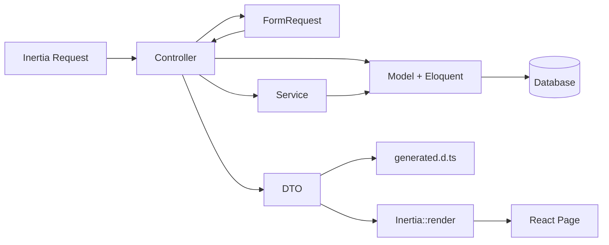
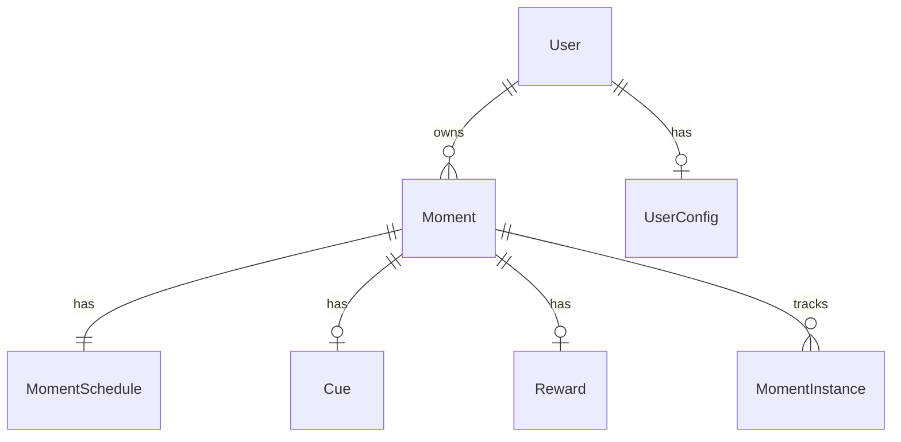
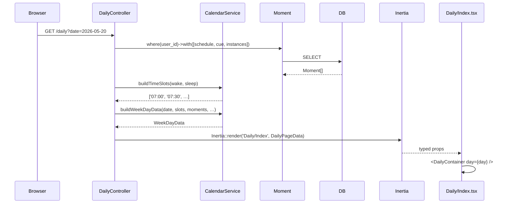
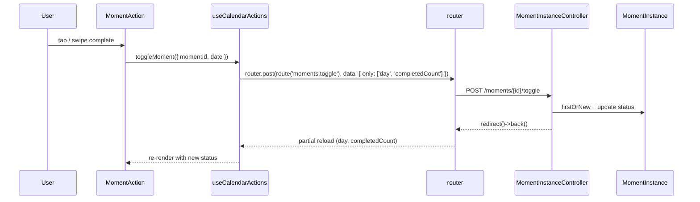
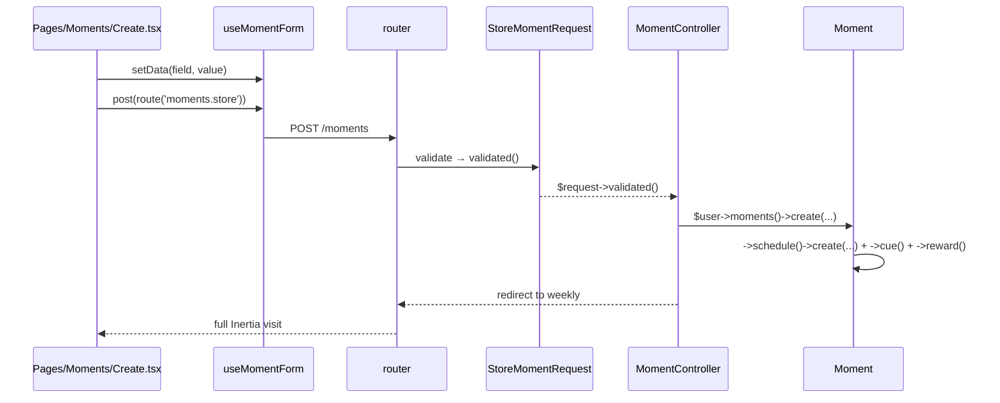

# Architecture

End-to-end architecture for Momentum — Laravel + Inertia + React + TypeScript.

## Overview

```
┌─ Backend (Laravel) ──────────────────────────────────────────┐
│  Controller → FormRequest → Service → Eloquent → DTO         │
│                                                ↓             │
│                                      Inertia::render(*PageData)
└──────────────────────────────────────────────┬───────────────┘
                                               │
                                  generated.d.ts (App.Data.*)
                                               │
┌─ Frontend (React + TS) ──────────────────────▼───────────────┐
│  Page (thin) → Container → TimeSlotCell → MomentAction       │
│            ↓                       ↑                          │
│       Hooks (useCalendarActions, useScheduling, …)            │
└──────────────────────────────────────────────────────────────┘
```

## Core Principles

1. **Backend owns business logic** — validation, authorisation, computation
2. **Inertia is a thin transport** — controllers return DTOs, pages receive typed props
3. **DTOs are contracts** — generated TypeScript types are the source of truth
4. **Feature-based frontend** — domains are self-contained; shared UI is generic
5. **One canonical row component** — `MomentAction` renders moments in every calendar view

---

# Backend

## Directory Structure

```
app/
├── Console/Commands/
├── Data/                       # DTOs (Spatie Laravel Data)
│   ├── SlotMomentData.php             # Moment in a calendar slot
│   ├── TimeSlotData.php
│   ├── WeekDayData.php
│   ├── MonthlyDayData.php
│   ├── MonthlyScheduleRowData.php
│   ├── DailyPageData.php              # Inertia page props
│   ├── WeeklyPageData.php
│   ├── MonthlyPageData.php
│   ├── MomentData.php                 # Moment for CRUD
│   ├── MomentScheduleData.php
│   ├── CueData.php
│   ├── RewardData.php
│   └── UserConfigData.php
├── Enums/
│   └── Frequency.php                  # daily | weekly | custom | once
├── Http/
│   ├── Controllers/
│   │   ├── DailyController.php
│   │   ├── WeeklyController.php
│   │   ├── MonthlyController.php
│   │   ├── MomentController.php       # CRUD
│   │   ├── MomentInstanceController.php   # Toggle completion
│   │   ├── ConfigController.php
│   │   ├── ContentController.php
│   │   └── ProfileController.php
│   └── Requests/
│       ├── StoreMomentRequest.php
│       ├── UpdateMomentRequest.php
│       ├── UpdateUserConfigRequest.php
│       └── ProfileUpdateRequest.php
├── Models/
│   ├── Moment.php
│   ├── MomentSchedule.php
│   ├── MomentInstance.php
│   ├── Cue.php
│   ├── Reward.php
│   ├── User.php
│   └── UserConfig.php
├── Providers/
│   └── TypeScriptTransformerServiceProvider.php
└── Services/
    ├── CalendarService.php            # Calendar aggregation + progress
    ├── MomentExportService.php
    └── MomentImportService.php
```

## Request Flow



## Controllers — Thin Orchestrators

A controller method does five things:

1. Type-hint a `FormRequest` (writes) or `Request` (reads)
2. Query Eloquent with **eager loading**
3. Delegate computation to a Service
4. Build a DTO
5. Return `Inertia::render('Page', $dto)`

```php
class DailyController extends Controller
{
    public function __construct(private CalendarService $calendar) {}

    public function index(Request $request): Response
    {
        $user = $request->user();
        $date = $request->filled('date')
            ? Carbon::parse($request->input('date'))
            : Carbon::today();

        $moments = Moment::query()
            ->where('user_id', $user->id)
            ->with(['schedule', 'cue', 'reward', 'instances' => fn ($q) =>
                $q->whereBetween('date', [$windowStart, $today])
            ])
            ->get();

        $slots = $this->calendar->buildTimeSlots($config->wake_time, $config->sleep_time);
        $day   = $this->calendar->buildWeekDayData($date, $slots, $dayMoments, …);

        return Inertia::render('Daily/Index', new DailyPageData(
            date: $date->toDateString(),
            day: $day,
            config: UserConfigData::fromModel($config),
            completedCount: $completed,
            totalCount: $total,
        ));
    }
}
```

| Controller | Verbs | Responsibility |
|---|---|---|
| `DailyController` | GET | Daily calendar view |
| `WeeklyController` | GET | 7-day grid |
| `MonthlyController` | GET | Month calendar |
| `MomentController` | CRUD | Moment create/edit/update/destroy |
| `MomentInstanceController` | POST | Toggle moment completion |
| `ConfigController` | GET, PUT | User config + moment export |
| `ProfileController` | (Breeze) | Profile management |

## FormRequests — Always for Writes

* `StoreMomentRequest`, `UpdateMomentRequest`, `UpdateUserConfigRequest`
* Inline `$request->validate()` only for read filtering on GET routes
* `$request->validated()` — never `$request->all()`

## Services — Computation Layer

### CalendarService

Pure computation. No HTTP, no rendering. Constructor-injected into controllers.

```php
class CalendarService
{
    public function buildTimeSlots(string $wakeTime, string $sleepTime, int $intervalMinutes = 30): array;
    public function snapToSlot(string $time, int $intervalMinutes = 30): string;
    public function calculateConsistency(Moment $moment, Carbon $windowStart, Carbon $today): ?int;
    public function buildSlotMoment(Moment $moment, Carbon $date, …): SlotMomentData;
    public function buildWeekDayData(Carbon $date, array $slots, Collection $dayMoments, …): WeekDayData;
    public function buildMonthDayData(Carbon $date, Collection $dayMoments, …): MonthlyDayData;
}
```

**Progress is computed, not stored:**
- Daily: 100 if completed today, else 0
- Weekly: ratio of completions within visible week
- Monthly: ratio of completions within current month
- **Consistency** is a separate metric — 28-day trailing %

### When to create a service

* Logic exceeds ~30 lines in a controller
* Logic is reused across controllers
* Pure computation (no HTTP, no rendering)

Don't create empty service classes — YAGNI.

## Models



**Key relationships:**
- `User` `hasMany` Moments, `hasOne` UserConfig
- `Moment` `hasOne` MomentSchedule / Cue / Reward, `hasMany` MomentInstances
- `MomentInstance` records completion (date + time + status)

**Lightweight rules:**
- Cast enums: `'frequency' => Frequency::class`
- Cast JSON: `'days_of_week' => 'array'`
- Relationships, scopes, simple accessors — fine
- Complex queries → Services

## DTOs

DTOs are the **contract** between Laravel and React. Every Inertia response uses one.

### Two Moment Shapes — Don't Conflate

| DTO | Used in | Has |
|---|---|---|
| `SlotMomentData` | Calendar views | `progress`, `status`, `instance_id`, `consistency` |
| `MomentData` | CRUD pages | `is_active`, `sort_order`, nested `schedule`/`cue`/`reward` |

`CalendarService::buildSlotMoment()` produces the slot shape. `MomentController` produces `MomentData` for create/edit. Don't try to unify them.

### Example

```php
#[TypeScript]
class SlotMomentData extends Data
{
    public function __construct(
        public int $id,
        public string $name,
        public ?string $description,
        public ?string $icon,
        public ?string $color,
        public ?Frequency $frequency,
        public ?int $consistency,        // 28-day window (0-100)
        public ?string $status,          // 'completed' | 'missed' | 'pending' | null
        public ?int $instance_id,
        public ?string $implementation_intention,
        public ?string $habit_stack_after,
        public ?string $environment_prompt,
        public ?int $progress = null,    // View-specific (0-100)
    ) {}
}
```

### TypeScript Generation

```bash
php artisan typescript:transform
```

Generates `resources/js/types/generated.d.ts` under the `App.Data` namespace.

## Routes

```php
// Calendar views
Route::get('/daily',   [DailyController::class, 'index'])->name('daily');
Route::get('/weekly',  [WeeklyController::class, 'index'])->name('weekly');
Route::get('/monthly', [MonthlyController::class, 'index'])->name('monthly');

// Moment CRUD
Route::resource('moments', MomentController::class)
    ->only(['create', 'store', 'edit', 'update', 'destroy']);

// Completion toggle
Route::post('/moments/{moment}/toggle', [MomentInstanceController::class, 'toggle'])
    ->name('moments.toggle');

// Config
Route::get('/config', [ConfigController::class, 'edit'])->name('config.edit');
Route::put('/config', [ConfigController::class, 'update'])->name('config.update');
```

All routes are named — Ziggy generates `route()` helpers for the frontend.

---

# Frontend

## Directory Structure

Breeze scaffolding stays **capitalised**; our domain code is **lowercase**. The casing split is intentional — it visually distinguishes framework code from app code.

```
resources/js/
├── app.tsx, ssr.tsx, bootstrap.ts
├── types/
│   ├── generated.d.ts          # ⚠️ DTO-generated — do not edit
│   ├── index.d.ts              # Global (User, PageProps)
│   └── ziggy.d.ts
├── Layouts/                    # Breeze layouts
├── Components/                 # Breeze UI primitives (don't modify)
├── Pages/                      # Thin Inertia shells
│   ├── Daily/Index.tsx
│   ├── Weekly/Index.tsx
│   ├── Monthly/Index.tsx
│   ├── Moments/{Create,Edit}.tsx
│   ├── Config/Edit.tsx
│   └── Auth/                   # Breeze
├── features/                   # Domain (our code)
│   ├── calendar/
│   │   ├── daily/DailyContainer.tsx
│   │   ├── weekly/{WeeklyContainer,DayRow,DaySection}.tsx
│   │   ├── monthly/{MonthlyContainer,MonthlyDayCell,MonthlyScheduleRow}.tsx
│   │   ├── components/
│   │   │   ├── MomentAction.tsx        # ★ Canonical row
│   │   │   └── TimeSlotCell.tsx        # Cell wrapper
│   │   ├── hooks/{useCalendarActions,useSwipeComplete}.ts
│   │   ├── utils.ts                    # getVisibleTimeSlots, snapToSlot, …
│   │   ├── types.ts                    # Re-exports App.Data.* under aliases
│   │   └── index.ts                    # Barrel
│   ├── moments/                # MomentForm, MomentModal, useMomentForm
│   ├── config/                 # ConfigForm, SleepHelper
│   └── scheduling/             # useScheduling state machine
└── shared/
    ├── components/
    │   ├── calendar/           # CalendarNav, CalendarSection, MomentIcon, …
    │   ├── EmptyState.tsx, FlashMessage.tsx, Cubes.tsx
    ├── constants/
    ├── types/enums.ts          # MomentStatus, SchedulingKind
    └── utils/
```

## Calendar Architecture — The Refactor's Centerpiece

The calendar feature is laid out so that adding a fourth view requires **zero new row UI**:

```
features/calendar/
├── daily/                  ─┐
├── weekly/                  ├─ View containers + view-specific helpers
├── monthly/                ─┘
├── components/             ─── Cross-view reusables (exactly 2 files)
│   ├── MomentAction.tsx        ── Pure presentation row
│   └── TimeSlotCell.tsx        ── Cell wrapper (mode/swipe/scheduling)
├── hooks/                  ─── Business logic (toggle, swipe gesture)
├── utils.ts                ─── Pure helpers (getVisibleTimeSlots, snapToSlot)
└── types.ts                ─── Re-exports App.Data.* under aliases
```

### Naming

| Concept | Pattern | Example |
|---|---|---|
| View orchestrator | `{Daily,Weekly,Monthly}Container` | `WeeklyContainer.tsx` |
| Canonical moment row | `MomentAction` | `features/calendar/components/MomentAction.tsx` |
| Cell wrapper | `TimeSlotCell` | `features/calendar/components/TimeSlotCell.tsx` |
| View-specific helper | Descriptive noun | `DayRow`, `MonthlyDayCell` |
| Cross-feature calendar UI | `Calendar*` prefix | `CalendarNav`, `CalendarProgressBar` |

**Removed in refactor — don't reintroduce:** `MomentDisplay`, `MomentActionItem`, `DailyTimeSlotCell`, `WeeklyGrid`, `MonthlyVerticalView`, `DailySlotCard`, `ConsistencyBar`, `CalendarMomentIcon`, `FrequencyBar`, `AddSlotPopover`, `MomentDetailTicker`.

## Component Responsibility Matrix

| Type | Location | Examples | Purpose |
|---|---|---|---|
| **Page** | `Pages/{Section}/Index.tsx` | `Daily/Index.tsx` | Thin Inertia shell; compose layout + container |
| **View Container** | `features/calendar/{view}/` | `DailyContainer` | Orchestrate one view |
| **View-specific helper** | `features/calendar/{view}/` | `DayRow`, `MonthlyDayCell` | Layout primitives for one view |
| **Shared row component** | `features/calendar/components/` | `MomentAction`, `TimeSlotCell` | Reused across all views |
| **Cross-feature calendar UI** | `shared/components/calendar/` | `CalendarNav`, `CalendarProgressBar` | UI framework, no calendar business logic |
| **Business logic** | `features/calendar/hooks/` | `useCalendarActions`, `useSwipeComplete` | Toggle, swipe, scheduling triggers |

## Data Flow

```mermaid
graph TD
    P[Page: Daily/Index.tsx] -->|App.Data.DailyPageData| C[DailyContainer]
    C -->|App.Data.TimeSlotData| T[TimeSlotCell]
    T -->|App.Data.SlotMomentData| M[MomentAction]

    P -.->|useCalendarActions| H[Hook]
    H -.->|router.post + only:[...]| P

    style P fill:#e1f5ff
    style C fill:#fff4e1
    style T fill:#fff4e1
    style M fill:#f0e1ff
    style H fill:#e1ffe1
```

## Hooks

| Hook | Location | Purpose |
|---|---|---|
| `useCalendarActions` | `features/calendar/hooks/` | `toggleMoment({ momentId, date, time?, reloadOnly? })` via Inertia partial reload |
| `useSwipeComplete` | `features/calendar/hooks/` | Drag-to-confirm gesture (returns pointer handlers + drag/hold progress) |
| `useScheduling` | `features/scheduling/` | Scheduling state machine (mode, kind transitions, day/time/icon selection) |
| `useMomentForm` | `features/moments/hooks/` | Moment create/edit form state |

## Dependency Direction

```
types/  →  shared/  →  features/  →  Pages/  →  Layouts/
```

* `Pages` import from `features/` and `shared/` — never the reverse
* `features/` import from `shared/` and `types/` — **never** from sibling features
  * Exception: type-only imports from `features/scheduling` (`SchedulingState`, `IsoDayNumber`) are tolerated
* `Layouts/` wrap pages — they don't import feature code

## Import Patterns

```tsx
// ✅ Page imports from feature barrel
import { DailyContainer, useCalendarActions } from '@/features/calendar';
import { MomentModal, useMomentForm } from '@/features/moments';
import { useScheduling } from '@/features/scheduling';
import { CalendarNav, CalendarProgressBar } from '@/shared/components/calendar';

// ❌ Deep path bypasses barrel
import DailyContainer from '@/features/calendar/daily/DailyContainer';

// ❌ Cross-feature runtime import
import { useMomentForm } from '@/features/moments';   // inside features/calendar/
```

---

# End-to-End Examples

## Daily View Load



## Toggle Completion



## Create Moment



---

# Key Takeaways

1. **Controllers orchestrate** — they don't compute. CalendarService does the work.
2. **DTOs are contracts** — every Inertia response is typed; the frontend never redefines a shape.
3. **One row component** — `MomentAction` renders moments in every view. Don't duplicate row UI.
4. **Two moment shapes** — `SlotMomentData` for views, `MomentData` for CRUD. Don't conflate.
5. **Progress is computed, not stored** — per-view in `CalendarService`.
6. **Feature isolation is strict** — runtime cross-feature imports are forbidden.
7. **Generated types are the source of truth** — `php artisan typescript:transform` after any DTO change.

---

# References

- React/Inertia rules: `.github/copilot-react-instructions.md`
- Full-stack rules: `.github/copilot-laravel-inertia-react-instructions.md`
- DTO rules: `.github/copilot-dto-instructions.md`
- Refactor history: `.docs/refactor/final-refactor.md`
- Spatie Laravel Data: https://spatie.be/docs/laravel-data
- Inertia.js: https://inertiajs.com
