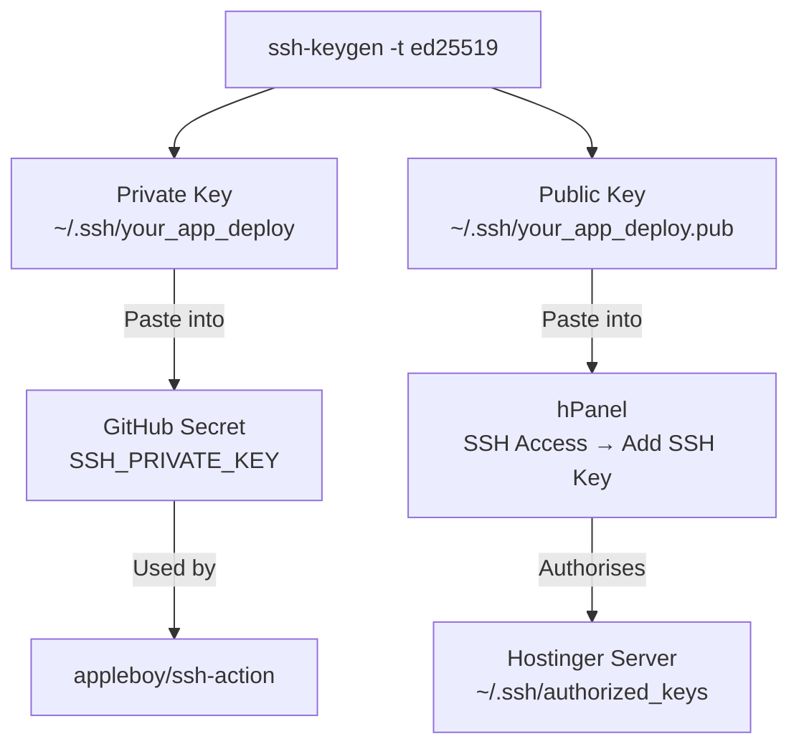
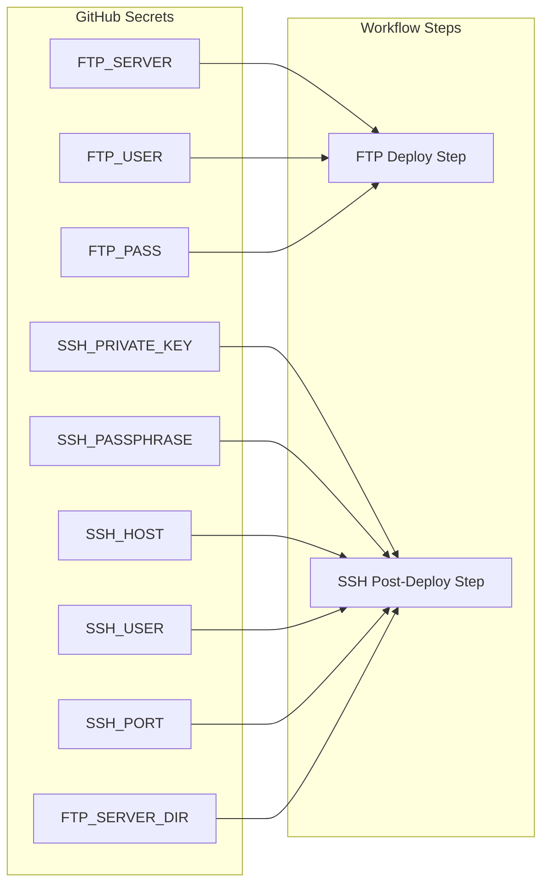
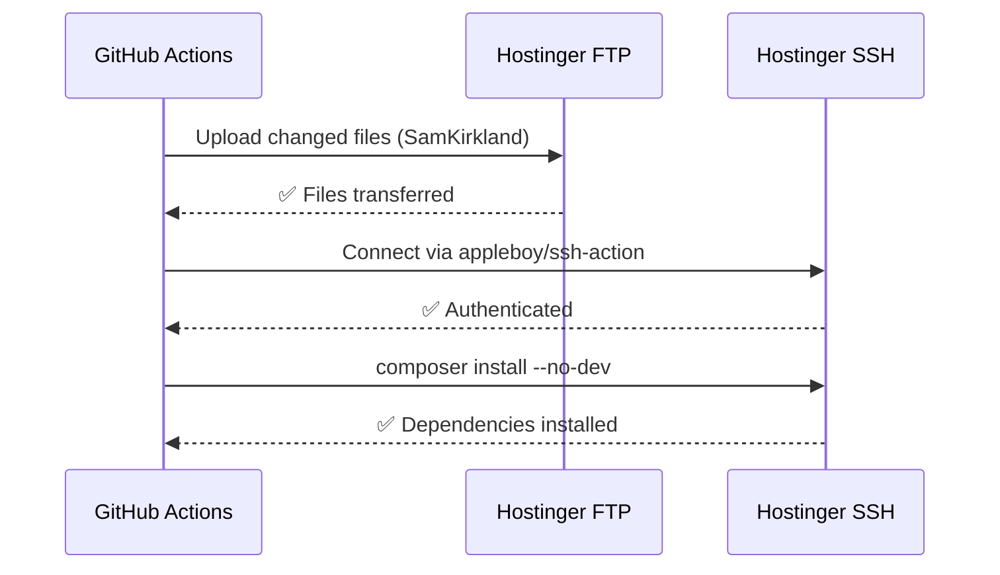

# GitHub Actions → Hostinger Deploy Guide

A step-by-step guide for setting up automated deployment to Hostinger shared hosting using FTP + SSH post-deploy hooks, based on real-world setup experience.

---

## Overview

Hostinger shared hosting has firewall restrictions that block direct SSH from GitHub-hosted runners. The solution is a **hybrid approach**:

- **FTP** → file transfer (GitHub runners can reach Hostinger FTP)
- **SSH via `appleboy/ssh-action`** → post-deploy commands (composer, artisan)


---

## Prerequisites

- Hostinger hosting account with SSH access enabled
- GitHub repository with Actions enabled
- A GitHub Environment set up (e.g. `production.yourapp.com`)
- Local machine with `ssh-keygen` available

---

## Step 1 — Enable SSH on Hostinger

1. Log into **hPanel**
2. Go to **Hosting → Manage → SSH Access**
3. Toggle SSH **on**
4. Note your SSH details:
   - **Host**: your server IP
   - **Username**: e.g. `uXXXXXXXXX`
   - **Port**: `65002` (Hostinger's non-standard SSH port)

> ⚠️ Do **not** use port 22 — Hostinger uses `65002` on shared hosting.

---

## Step 2 — Generate SSH Key Pair

Generate a dedicated deploy key on your local machine. **Do not reuse your personal SSH key.**

```bash
ssh-keygen -t ed25519 -C "github-actions-deploy" -f ~/.ssh/your_app_deploy
```

- When prompted for a passphrase, set a strong one — note it down
- This creates two files:
  - `~/.ssh/your_app_deploy` — **private key** (goes into GitHub secret)
  - `~/.ssh/your_app_deploy.pub` — **public key** (goes into hPanel)



---

## Step 3 — Add Public Key to hPanel

1. Copy the public key:
   ```powershell
   # Windows PowerShell
   Get-Content "$env:USERPROFILE\.ssh\your_app_deploy.pub" | Set-Clipboard
   ```
   ```bash
   # Mac/Linux
   cat ~/.ssh/your_app_deploy.pub | pbcopy
   ```

2. In hPanel → **SSH Access → Add SSH Key** → paste and save

3. Test the connection from your local machine:
   ```bash
   ssh -i ~/.ssh/your_app_deploy -p 65002 uXXXXXXXXX@your-server-ip
   ```
   You should see the Hostinger welcome banner. If you see `Permission denied (publickey)`, the public key wasn't saved correctly — try again.

---

## Step 4 — Set Up GitHub Secrets

Go to **GitHub → Repository → Settings → Environments → your environment → Secrets**.

Add the following secrets:

| Secret | Value | Notes |
|---|---|---|
| `SSH_HOST` | your server IP | Server IP from hPanel SSH page |
| `SSH_USER` | your Hostinger username | e.g. `uXXXXXXXXX` |
| `SSH_PORT` | `65002` | Hostinger's SSH port |
| `SSH_PRIVATE_KEY` | Contents of `~/.ssh/your_app_deploy` | Full key including `-----BEGIN/END-----` lines |
| `SSH_PASSPHRASE` | your key passphrase | Passphrase you set in Step 2 |
| `FTP_SERVER` | your server IP or domain | From hPanel SSH page |
| `FTP_USER` | your FTP username | From hPanel → FTP Accounts (often `uXXXXXXXXX.yourapp.com`) |
| `FTP_PASS` | your FTP password | From hPanel → FTP Accounts |
| `FTP_PORT` | `21` | Standard FTP port |
| `FTP_SERVER_DIR` | `/home/uXXXXXXXXX/domains/yourapp.com/public_html` | Absolute path on server |

> ⚠️ **SSH_PRIVATE_KEY pitfall**: The secret must contain the key with **newlines intact**. 
> On Windows, open the key in Notepad and Ctrl+A → Ctrl+C, then paste into GitHub.
> Do **not** copy from a terminal — shell output may collapse newlines.



---

## Step 5 — Create the Workflow

Create `.github/workflows/deploy-production.yml`:

```yaml
name: Deploy to Production

on:
  push:
    branches:
      - release/production

jobs:
  deploy:
    runs-on: ubuntu-latest
    environment: production.yourapp.com
    steps:
      - name: Checkout code
        uses: actions/checkout@v3
        with:
          fetch-depth: 0

      - name: Deploy changed files via FTP
        uses: SamKirkland/FTP-Deploy-Action@v4.3.6
        with:
          server: ${{ secrets.FTP_SERVER }}
          username: ${{ secrets.FTP_USER }}
          password: ${{ secrets.FTP_PASS }}
          port: ${{ secrets.FTP_PORT }}
          protocol: ftp
          local-dir: ./
          server-dir: ${{ secrets.FTP_SERVER_DIR }}/
          state-name: .ftp-deploy-sync-state.json
          exclude: |
            .git/**
            .github/**
            .docs/**
            .vscode/**
            node_modules/**
            vendor/**
            tests/**
            storage/logs/**
            storage/framework/cache/**
            storage/framework/sessions/**
            storage/framework/testing/**
            storage/framework/views/**
            .env*
            *.log
            phpunit.xml
            package*.json

      - name: Composer install (no-dev, optimized)
        uses: appleboy/ssh-action@v1.0.3
        with:
          host: ${{ secrets.SSH_HOST }}
          username: ${{ secrets.SSH_USER }}
          port: ${{ secrets.SSH_PORT }}
          key: ${{ secrets.SSH_PRIVATE_KEY }}
          passphrase: ${{ secrets.SSH_PASSPHRASE }}
          script: |
            cd ${{ secrets.FTP_SERVER_DIR }}
            composer install --no-dev --no-interaction --optimize-autoloader
```

---

## Step 6 — Push and Verify

```bash
git push origin release/production
```

Watch the Actions tab in GitHub. Expected flow:



---

## Common Errors & Fixes

### `530 Login incorrect` (FTP step)
- Wrong `FTP_USER` — check hPanel → FTP Accounts for the exact username (often includes subdomain: `u654874923.yourapp.com`)
- Wrong `FTP_PASS` — this is the **FTP account password**, not your hPanel login

### `ssh: no key found`
- `SSH_PRIVATE_KEY` secret has collapsed newlines
- Re-paste the key: open in Notepad → Ctrl+A → Ctrl+C → paste into GitHub secret

### `dial tcp x.x.x.x:65002: i/o timeout`
- The GitHub runner IP is blocked by Hostinger's firewall
- `appleboy/ssh-action` uses a Go SSH implementation which often bypasses this — but raw `ssh` or `rsync` from `run:` steps will not work
- **Do not** attempt rsync from a `run:` step — use `appleboy/ssh-action` exclusively for SSH

### `Permission denied (publickey)`
- Public key not added to hPanel, or the wrong public key was added
- Verify: `cat ~/.ssh/your_app_deploy.pub` matches what's in hPanel

### PHP command not found in SSH script
- Hostinger shared hosting requires the full PHP binary path
- Use `/usr/local/php84/bin/php` for PHP 8.4
- Check available versions: `ls /usr/local/php*/bin/php`

---

## Notes

- **Do not hardcode `65002`** in the workflow — use `${{ secrets.SSH_PORT }}` so it can be changed without a code push
- **`vendor/` is excluded from FTP** — composer must run on the server via SSH after each deploy
- **`.env` is excluded** — manage production env variables directly on the server; never deploy `.env`
- The FTP state file `.ftp-deploy-sync-state.json` lives on the server and tracks what's changed — don't delete it or the next deploy will re-upload everything
